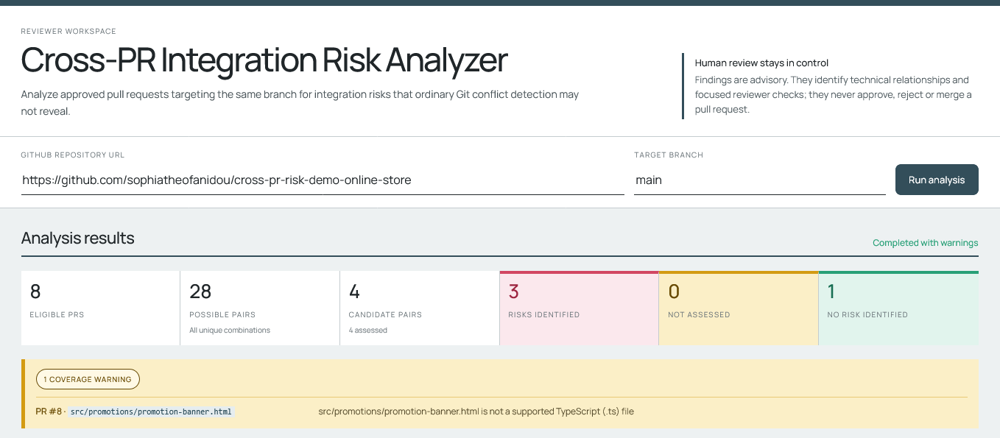
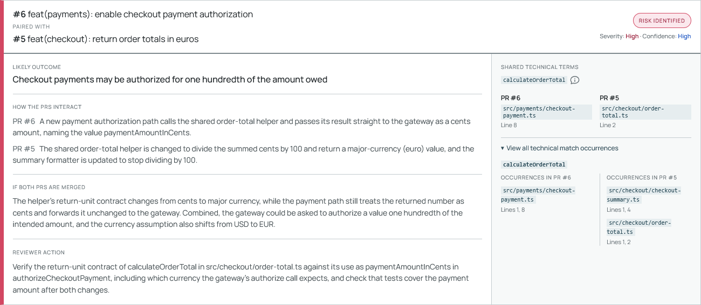

# Cross-PR Integration Risk Analyzer

[](https://github.com/sophiatheofanidou/cross-pr-integration-risk-analyzer/actions/workflows/ci.yml)

## Overview

### The problem

Modern software teams often develop, review, and approve multiple pull requests in parallel. As teams and codebases grow, independently developed changes can affect related contracts, behaviour, data, or system assumptions without their authors and reviewers being aware of one another. Git may merge the files cleanly and both PRs may pass their individual checks, while their combination introduces a build failure or incorrect runtime behaviour.

### Why it matters

When such an interaction is discovered only after integration, the consequences can include broken builds, runtime defects, delayed releases, repeated validation, additional debugging effort, emergency fixes, and disruption to planned production delivery. The cost is not only technical; it consumes developer and reviewer time and can slow the work of multiple teams.

### The solution

The Cross-PR Integration Risk Analyzer helps reviewers find which approved pull-request combinations deserve joint investigation before merge. It systematically examines the approved change set, uses deterministic structural analysis to reduce the search space, applies focused AI reasoning only to technically related combinations, and presents the result as explainable evidence and targeted reviewer actions.

### Who it is for

The primary users are code reviewers, senior engineers, and tech leads working with several concurrently approved changes against the same branch. The tool supports their judgment; it does not make merge decisions for them.

Read the [Project Vision](docs/design/00-project-vision.md) and [Problem Analysis](docs/design/01-problem-analysis.md) for the full product motivation and scope.

## Why this workflow is needed

Existing tools address adjacent parts of the problem:

- Git identifies textual conflicts but does not explain behaviourally incompatible changes that merge cleanly.
- CI validates the code states it is configured to build and test, but does not tell a reviewer which independent pending PRs should be examined together before merge.
- AI coding assistants can compare two PRs selected by a person, but the person must already know which pair is worth investigating.

This project focuses on the discovery gap between independently reviewed changes. Its value is not merely asking an AI model to compare two changes that a person has already selected. It systematically identifies which pairs deserve joint investigation, applies semantic reasoning only where deterministic evidence justifies it, and reports what the reviewer should inspect.

The broader positioning and comparison with adjacent tools are documented in the [Current Solution Landscape](docs/design/03-current-solution-landscape.md).

## How the analyzer works

1. **Retrieve the review scope.** The analyzer retrieves the open, non-draft, actively approved pull requests targeting the selected branch from the configured source-control platform.
2. **Generate the complete pair set.** Every unordered combination of eligible pull requests is considered once.
3. **Discover Candidate Pairs deterministically.** A language-aware structural analyzer produces explainable evidence when a technical term associated with a changed region in one PR also occurs structurally in a changed file from another PR.
4. **Retrieve focused context.** Only the relevant change hunks, bounded source snippets, evidence locations, PR metadata, and warnings are prepared for assessment.
5. **Assess the selected pairs.** A structured AI Risk Assessment evaluates each Candidate Pair with sufficient context, distinguishing a plausible risk from a compatible or coincidental structural relationship.
6. **Support reviewer judgment.** The reviewer interface presents risk-first results, the contribution of each PR, the possible combined effect, relevant code locations, confidence, severity, reviewer actions, no-risk reasoning, and coverage warnings.

**What deterministic evidence means.** This is a reproducible source-code relationship found without AI judgment. For example, one PR may change code associated with a function name while the same name appears as a structural call or reference in a file changed by another PR. The analyzer records the term and the exact file and source locations that produced the match. Given the same PR revisions and source content, this stage produces the same evidence; it does not claim that the two occurrences are the same semantic symbol or that a risk already exists.

**Why this controls AI cost.** Pairs without deterministic evidence are filtered before the AI stage and cause no model call. For each retained Candidate Pair, Context Retrieval selects only the relevant change hunks, evidence locations, and bounded source snippets. The complete repository is never sent to the AI provider. This reduces the number of paid requests, limits input tokens and cost, and keeps every assessment focused on the evidence that caused the pair to be selected.

<p align="center">
  
</p>

<p align="center"><em>The reviewer workspace keeps the full analysis scope visible: eight eligible pull requests produce 28 possible pairs, deterministic Candidate Discovery retains four for assessment, and unsupported input remains explicit.</em></p>

See [Architecture](docs/design/02-architecture.md), [Candidate Discovery](docs/design/04-candidate-discovery.md), [Context Retrieval](docs/design/05-context-retrieval.md), and [AI Risk Analysis](docs/design/06-ai-risk-analysis.md) for the detailed boundaries and tradeoffs.

## How the MVP was validated

To test the end-to-end behaviour against known ground truth, the current MVP was evaluated with a small public [controlled demo repository](https://github.com/sophiatheofanidou/cross-pr-risk-demo-online-store). It contains eight open, approved pull requests created from the same base commit. Each PR is valid independently, while selected combinations deliberately represent three known integration risks and one structurally related no-risk control.

The important result is not simply that the analyzer produced four findings. From 28 possible PR pairs, deterministic Candidate Discovery selected exactly the four designed technically related pairs and filtered the remaining 24 before any AI assessment. The AI Risk Assessment then identified all three known risks and correctly dismissed the deliberately coincidental match.

The scenarios establish different capabilities:

| Controlled scenario | Ground truth | Analyzer outcome |
|---|---|---|
| A function contract changes from positional parameters to a request object while another PR adds a caller using the previous contract | The combined code fails compilation/type-checking | Contract risk identified with High severity |
| A function changes from a synchronous return value to an asynchronous result while another PR consumes it synchronously | The combined code fails compilation/type-checking | Control-flow and return-contract risk identified with High severity |
| A numeric return value changes business unit while another PR continues to interpret it using the previous unit | The combined code still builds but produces materially incorrect runtime behaviour | Semantic data-unit risk identified with High severity |
| Separate modules contain unrelated local helpers with the same name | The pair builds and behaves correctly | Coincidental structural match correctly dismissed |

An unsupported file type in the final scenario also produced an explicit coverage warning. This matters because unsupported input remained visible instead of being silently treated as evidence that no relationship existed.

<p align="center">
  
</p>

<p align="center"><em>A semantic data-unit mismatch can remain type-correct while producing materially incorrect runtime behaviour. The result connects both changes, explains their combined effect, and identifies the contract a reviewer should verify.</em></p>

This controlled result demonstrates the end-to-end workflow and cost-aware filtering; it is not a claim of production-scale precision or recall. The detailed PR matrix, expected-versus-actual evidence, provider usage, and evaluation limitations belong in the [Controlled Demo Evaluation](docs/demo-evaluation.md).

## Safety and trust boundaries

The analyzer is an advisory, human-in-the-loop tool. It does not:

- approve, reject, or merge pull requests;
- establish textual mergeability;
- check out or construct combined PR states;
- execute builds or tests for the analyzed PR combinations;
- send the complete repository to the AI provider;
- treat a structural name match as proof of a semantic dependency;
- convert missing critical context into a no-risk conclusion.

Source-control and AI-provider data are validated at their external boundaries. Provider failures are isolated to the affected Candidate Pair, while unexpected internal failures remain operation-level errors. Required credentials stay server-side and are never included in the frontend or committed to Git.

The complete release boundary is defined in the [MVP Specification](docs/design/07-mvp-specification.md), with major decisions recorded in the [Design Log](docs/design/08-design-log.md).

## Current MVP implementation

The architecture separates source-control integration, structural analysis, Context Retrieval, and AI Risk Assessment behind focused boundaries so that future implementations can extend platforms, languages, and model providers without redefining the reviewer workflow.

The current portfolio MVP is an npm-workspace monorepo with a Node.js and TypeScript backend and an Angular frontend:

```text
apps/
├── api/    Node.js and TypeScript analysis backend
└── web/    Angular reviewer interface
```

Key technologies:

- [Angular](https://angular.dev/) for the reviewer-facing application;
- [Node.js](https://nodejs.org/) and [TypeScript](https://www.typescriptlang.org/) for the backend and analysis pipeline;
- the [GitHub REST API](https://docs.github.com/en/rest) for pull-request, review, diff, and selected-file retrieval;
- [Tree-sitter](https://tree-sitter.github.io/tree-sitter/), a local parsing library that builds syntax trees, to recognize declarations, calls, and references in changed TypeScript `.ts` files without using AI;
- the [Claude API](https://platform.claude.com/docs/en/api/messages) for risk assessment, accessed from the TypeScript backend through Anthropic's official [TypeScript SDK](https://github.com/anthropics/anthropic-sdk-typescript);
- [Zod](https://zod.dev/) for runtime validation at external data boundaries;
- [Vitest](https://vitest.dev/) and [ESLint](https://eslint.org/) for automated verification;
- [GitHub Actions](https://docs.github.com/en/actions) for clean CI verification.

## Run locally

Requirements:

- Node.js `>=24.15.0 <25.0.0`
- npm `11.17.0`

Install the exact locked dependency graph and verify both workspaces:

```text
npm ci
npm run build
npm run type-check
npm test
npm run lint
```

On Windows PowerShell, use `npm.cmd` in place of `npm` if the execution policy blocks `npm.ps1`.

### Run the live application

The backend requires these environment variables in the shell that starts it:

- `GITHUB_TOKEN` — a GitHub token that can read the analyzed repository;
- `ANTHROPIC_API_KEY` — an Anthropic API key;
- `ANTHROPIC_MODEL` — the Claude model ID used for assessment.

Keep credentials out of source files, command history, frontend configuration, and Git.

Build and start the backend from the repository root:

```text
npm run build --workspace @cross-pr-risk-analyzer/api
npm run start --workspace @cross-pr-risk-analyzer/api
```

In a second terminal, start the Angular development server:

```text
npm run start --workspace web
```

Open `http://127.0.0.1:4200/`. The Angular development proxy sends relative `/api` requests to the backend at `http://127.0.0.1:3000`.

The real-provider smoke test is opt-in and may incur Anthropic charges. Normal tests exclude it. Run it only with explicit intent and the required environment variables:

```text
npm run test:claude-smoke --workspace @cross-pr-risk-analyzer/api
```

## Tests and CI

Normal verification covers GitHub response validation and eligibility, pair generation, Candidate Discovery, bounded diff reconstruction, Context Retrieval, Claude output normalization, pair-scoped failure handling, the synchronous API, and the primary Angular reviewer states.

The [GitHub Actions CI workflow](.github/workflows/ci.yml) runs clean install, production builds, type-checking, normal tests, and lint for pushes to `main` and pull requests. It requires no project secrets and never invokes the paid Claude smoke test.

## Current limitations

- Structural Candidate Discovery currently supports changed TypeScript `.ts` files only.
- Deleted and renamed files are not structurally analyzed.
- Tree-sitter provides syntax-aware name correlation, not complete semantic symbol resolution. Separate modules can therefore contain unrelated declarations or references with the same name.
- A same-name relationship may become a Candidate Pair even when the underlying code is independent. The semantic assessment stage evaluates this uncertainty instead of treating every structural match as a confirmed risk.
- Analysis is synchronous and has no authentication, hosted service, persistent cache, or run history.
- The controlled evaluation demonstrates known behaviour but does not measure production-scale accuracy.
- The application is a portfolio MVP, not a production-ready service.

## Future direction

The project can evolve from the current focused MVP into a broader cross-PR review platform. Planned directions include:

- structural analyzers for additional programming languages and richer symbol resolution;
- integrations with additional source-control platforms such as Azure DevOps and GitLab;
- support for multiple AI providers;
- tiered AI analysis, using a lower-cost screening stage before detailed assessment when Candidate Pair volume justifies it;
- a persistent result cache, initially suitable for a local SQLite implementation, so unchanged PR revisions and assessment context do not repeat paid AI calls;
- provider prompt caching when stable repeated prompt content produces measurable savings;
- richer repository context and retrieval strategies for cases where changed-file evidence is insufficient;
- opt-in per-run and per-pair operational metrics for latency, tokens, model, approximate cost, request status, and bounded failure reasons;
- asynchronous analysis, persistent history, continuous monitoring, and richer reviewer workflows as the product expands beyond a local MVP.

The long-term architectural direction is provider-neutral and multi-language, while the current implemented release remains explicit and honest about its GitHub, TypeScript, and Claude scope.

The current milestone state and verification history are maintained in the [Implementation Plan](planning/implementation-plan.md).
