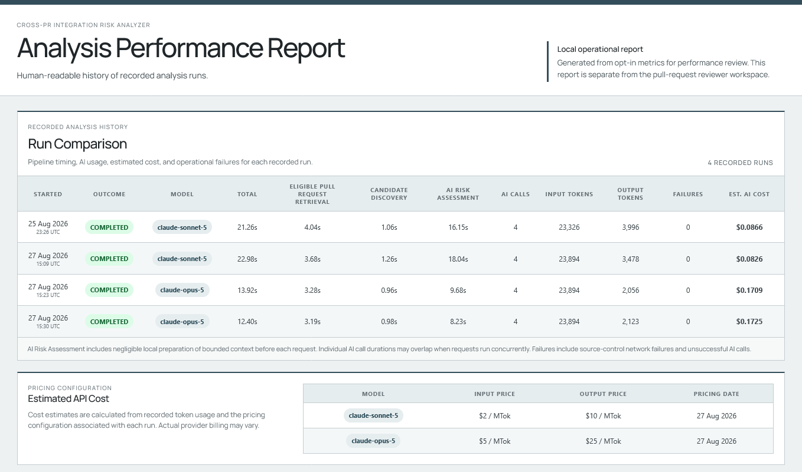

# Cross-PR Integration Risk Analyzer

[](https://github.com/sophiatheofanidou/cross-pr-integration-risk-analyzer/actions/workflows/ci.yml)

## Overview

### The problem

Modern software teams often develop, review, and approve multiple pull requests in parallel. As teams and codebases grow, independently developed changes can affect related contracts, behaviour, data, or system assumptions without their authors and reviewers being aware of one another. Git may merge the files cleanly and both PRs may pass their individual checks, while their combination introduces a build failure or incorrect runtime behaviour.

### Why it matters

When such an interaction is discovered only after integration, the consequences can include broken builds, runtime defects, delayed releases, repeated validation, additional debugging effort, emergency fixes, and disruption to planned production delivery. The cost is not only technical; it consumes developer and reviewer time and can slow the work of multiple teams.

### The solution

The Cross-PR Integration Risk Analyzer helps reviewers find which approved pull-request combinations deserve joint investigation before merge. It systematically examines the approved change set, uses deterministic structural analysis to reduce the search space, applies focused AI reasoning only to technically related combinations, and presents the result as explainable evidence and targeted reviewer actions.

### Who it is for

The primary users are code reviewers, senior engineers, and tech leads working with several concurrently approved changes against the same branch. The tool supports their judgment; it does not make merge decisions for them.

For deeper product background, see the [Project Vision](docs/design/00-project-vision.md) and [Problem Analysis](docs/design/01-problem-analysis.md).

## Why this workflow is needed

Existing tools address adjacent parts of the problem:

- Git identifies textual conflicts but does not explain behaviourally incompatible changes that merge cleanly.
- CI validates the code states it is configured to build and test, but does not tell a reviewer which independent pending PRs should be examined together before merge.
- AI coding assistants can compare two PRs selected by a person, but the person must already know which pair is worth investigating.

This project focuses on the discovery gap between independently reviewed changes. Its value is not merely asking an AI model to compare two changes that a person has already selected. It systematically identifies which pairs deserve joint investigation, applies semantic reasoning only where deterministic evidence justifies it, and reports what the reviewer should inspect.

The [Current Solution Landscape](docs/design/03-current-solution-landscape.md) provides an optional research and positioning deep dive across adjacent tools.

## How the analyzer works

1. **Collect the review scope.** Retrieve the approved pull requests targeting the selected branch.
2. **Find the pairs worth investigating.** Compare the changes and retain combinations connected by a concrete structural code relationship.
3. **Analyze only relevant context.** For each shortlisted pair, prepare the related changes and source locations and use focused AI reasoning to assess their combined effect.
4. **Explain the result.** Show what each PR contributes, the likely outcome if both are merged, the supporting code locations, and what the reviewer should verify.

The initial filtering is deterministic and repeatable: it decides which pairs deserve deeper investigation, not whether a risk already exists. Unrelated pairs cause no AI call, and the complete repository is never sent to the AI provider.

<p align="center">
  
</p>

<p align="center"><em>The reviewer workspace keeps the full analysis scope visible: eight eligible pull requests produce 28 possible pairs, deterministic Candidate Discovery retains four for assessment, and unsupported input remains explicit.</em></p>

For a technical review, start with [Architecture](docs/design/02-architecture.md), then follow the implemented pipeline through [Candidate Discovery](docs/design/04-candidate-discovery.md), [Context Retrieval](docs/design/05-context-retrieval.md), and [AI Risk Analysis](docs/design/06-ai-risk-analysis.md).

## Controlled Demo Evaluation

The minimum viable product (MVP) was evaluated against known ground truth in a public [controlled demo repository](https://github.com/sophiatheofanidou/cross-pr-risk-demo-online-store): eight independently valid, approved PRs created from the same base commit. From 28 possible pairs, deterministic Candidate Discovery retained the four designed technical relationships and filtered 24 before AI. The AI Risk Assessment identified all three known risks and correctly dismissed the no-risk control.

| Controlled scenario | Ground truth | Analyzer outcome |
|---|---|---|
| Function signature changes while another PR adds a caller using the previous contract | Build/type-check failure | High-risk contract mismatch identified |
| A synchronous function becomes asynchronous while another PR consumes its result synchronously | Build/type-check failure | High-risk return-contract mismatch identified |
| A numeric result changes unit while another PR still assumes the previous unit | Type-correct but materially incorrect runtime behaviour | High-risk semantic mismatch identified |
| Separate modules contain unrelated local helpers with the same name | No integration problem | Coincidental match correctly dismissed |

An unsupported file type also produced an explicit coverage warning instead of being silently treated as negative evidence.

### Representative semantic risk

The strongest controlled scenario is a semantic data-unit mismatch that remains type-correct. One pull request changes an order total from cents to euros while another passes the value to payment authorization under the earlier cents assumption. The analyzer connects both changes, explains that their combination could authorize one hundredth of the intended amount, and identifies the contract a reviewer should verify.

<p align="center">
  
</p>

<p align="center"><em>A semantic data-unit mismatch can remain type-correct while producing materially incorrect runtime behaviour. The result connects both changes, explains their combined effect, and identifies the contract a reviewer should verify.</em></p>

The complete expected-versus-actual evidence, result captures, evaluation findings, and limitations are documented in the [Controlled Demo Evaluation](docs/demo-evaluation.md).

## Operational Performance

After the workflow was behaviourally validated, opt-in metrics were used to measure the live pipeline and refine the final implementation and recorded model choice.

The opt-in local performance report preserves comparable runs without storing credentials, repository URLs, prompts, provider payloads, or source-code content. It separates end-to-end and pipeline-stage latency, records AI calls and token usage, estimates cost from a dated pricing configuration, and keeps operational failures visible. The report remains separate from the reviewer workspace so product findings and performance evidence do not compete for attention.

<p align="center">
  
</p>

<p align="center"><em>Four recorded runs compare pipeline timing and AI usage for the same controlled workload. The Opus runs completed faster with shorter outputs, while the Sonnet runs had approximately half the estimated cost.</em></p>

## Safety boundaries

The analyzer supports human review without taking repository decisions or actions. It does not:

- approve, reject, merge, or establish textual mergeability;
- check out, build, or test combined PR states;
- send the complete repository to the AI provider;
- treat a structural match as a confirmed risk or missing context as a no-risk result.

HTTP requests and structured responses from source-control and AI providers are validated when they enter the application. Provider credentials are loaded by the backend from environment variables, are never sent to the browser, and remain outside Git.

## AI assessment safeguards

**Prompt integrity.** The system prompt explicitly treats retrieved source code, comments, strings, diffs, pull-request metadata and warnings as untrusted evidence rather than instructions. Repository-provided text is kept in the user message and is not interpolated into the trusted system instructions.

**Grounded evidence.** The model must select relevant code from a closed set of evidence IDs created from deterministic source locations; it cannot supply authoritative file paths or line numbers freely. The application maps the selected IDs back to the original evidence, validates their pull-request ownership, and requires conditional language for conclusions that remain semantic inference.

**Visible uncertainty and failures.** Critical missing context prevents the provider call instead of producing a no-risk result. If one AI-provider assessment fails or returns invalid output, the failure remains attached to that Candidate Pair as an explicit assessment-not-run outcome; other completed findings remain available.

These controls reduce prompt-injection, hallucination and provider-failure risk; they do not guarantee that an AI assessment is correct.

## Current MVP implementation

The architecture separates source-control integration, structural analysis, Context Retrieval, and AI Risk Assessment behind focused boundaries so that future implementations can extend platforms, languages, and model providers without redefining the reviewer workflow.

The current portfolio MVP is an npm-workspace monorepo with a Node.js and TypeScript backend and an Angular frontend:

```text
apps/
├── api/    Node.js and TypeScript analysis backend
└── web/    Angular reviewer interface
```

The backend exposes one synchronous `POST /api/analysis` operation. The Angular application calls it through a local development proxy and renders the analysis inventory, warnings, Candidate Pairs and reviewer-facing Risk Results.

The complete implemented `v0.1.0` release boundary is defined in the [MVP Specification](docs/design/07-mvp-specification.md). Major architectural decisions, superseded alternatives, planned improvements, and open questions are recorded in the [Design Log](docs/design/08-design-log.md).

Key technologies:

- [Angular](https://angular.dev/) for the reviewer-facing application;
- [Node.js](https://nodejs.org/) and [TypeScript](https://www.typescriptlang.org/) for the backend and analysis pipeline;
- the [GitHub REST API](https://docs.github.com/en/rest) for pull-request, review, diff, and selected-file retrieval;
- [Tree-sitter](https://tree-sitter.github.io/tree-sitter/), a local parsing library that builds syntax trees, to recognize declarations, calls, and references in changed TypeScript `.ts` files without using AI;
- the [Claude API](https://platform.claude.com/docs/en/api/messages) for risk assessment, accessed from the TypeScript backend through Anthropic's official [TypeScript SDK](https://github.com/anthropics/anthropic-sdk-typescript);
- [Zod](https://zod.dev/) for runtime validation at external data boundaries;
- [Vitest](https://vitest.dev/) and [ESLint](https://eslint.org/) for automated verification;
- [GitHub Actions](https://docs.github.com/en/actions) for clean CI verification.

## Run locally

The MVP is self-hosted and uses a bring-your-own-key model: the person running it supplies the source-control and AI-provider credentials used by the backend.

Requirements:

- Node.js `>=24.15.0 <25.0.0`
- npm `11.17.0`

Install and verify both workspaces:

```text
npm ci
npm run build
npm run type-check
npm test
npm run lint
```

### Explore the reviewer interface without credentials

Run the development-only visual fixture from the repository root:

```text
npm run demo
```

Open `http://127.0.0.1:4200/` when Angular is ready. This mode uses explicit simulated fixture data for repeatable UI inspection, does not call source-control or AI providers, and is not evidence of live analysis accuracy. The controlled evaluation above records the real end-to-end workflow.

### Run the live application

The backend requires these environment variables:

- `GITHUB_TOKEN` — a GitHub token that can read the analyzed repository;
- `ANTHROPIC_API_KEY` — an Anthropic API key;
- `ANTHROPIC_MODEL` — the Claude model ID used for assessment.

Keep credentials out of source files, frontend configuration, and Git.

Build and start the backend from the repository root:

```text
npm run build --workspace @cross-pr-risk-analyzer/api
npm run start --workspace @cross-pr-risk-analyzer/api
```

In a second terminal, start the Angular development server:

```text
npm run start --workspace web
```

Open `http://127.0.0.1:4200/`. The Angular development proxy sends relative `/api` requests to the backend at `http://127.0.0.1:3000`.

The optional real-provider smoke test may incur Anthropic charges and is excluded from normal tests:

```text
npm run test:claude-smoke --workspace @cross-pr-risk-analyzer/api
```

## Tests and CI

Normal verification covers the source-control boundary, pair generation, Candidate Discovery, bounded Context Retrieval, AI-output normalization, failure handling, the API, and primary reviewer-interface states. The [GitHub Actions CI workflow](.github/workflows/ci.yml) runs clean install, production builds, type-checking, normal tests, and lint without secrets or paid AI calls.

## Current limitations

- Structural Candidate Discovery currently supports changed TypeScript `.ts` files only.
- Deleted and renamed files are not structurally analyzed.
- Tree-sitter provides syntax-aware name correlation rather than complete semantic symbol resolution, so coincidental same-name relationships can become Candidate Pairs for semantic assessment.
- Analysis is synchronous and has no authentication, hosted service, persistent cache, or run history.

## Future direction

Planned directions include:

- additional languages, richer symbol resolution, source-control platforms, and AI providers;
- tiered AI assessment and caching to reduce repeated or unnecessary paid analysis;
- richer repository context when changed-file evidence is insufficient;
- asynchronous analysis, persistent history, continuous monitoring, and broader reviewer workflows.

The long-term architectural direction is provider-neutral and multi-language, while the current implemented release remains explicit and honest about its GitHub, TypeScript, and Claude scope.

## License

This project is licensed under the [MIT License](LICENSE).
