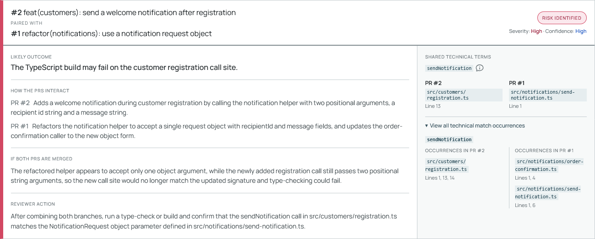
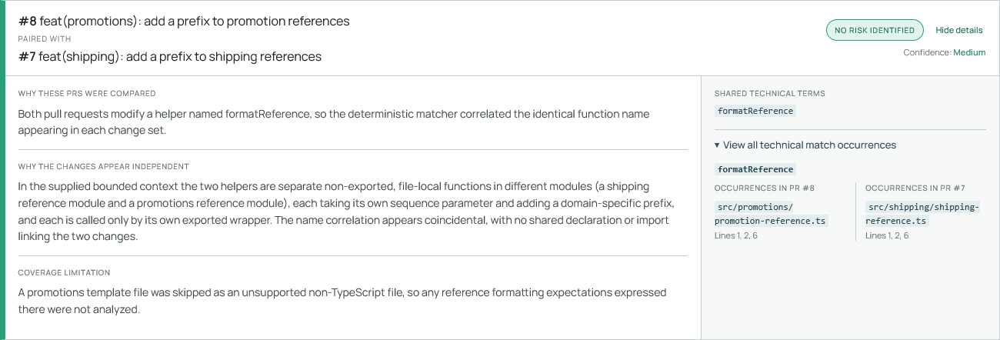

# Controlled Demo Evaluation

## Purpose

This evaluation checks whether the portfolio MVP can find and explain known cross-PR integration risks without analyzing every possible pull-request pair with AI.

The public [Cross-PR Risk Demo Online Store](https://github.com/sophiatheofanidou/cross-pr-risk-demo-online-store) is a small runnable TypeScript application created for this purpose. Eight pull requests were branched from the same base commit, kept open, and approved against `main`. Each PR is valid independently. Four designed pairs test build failure, semantic failure, a coincidental structural match, and incomplete language coverage.

This is a controlled behavioural demonstration, not a production-scale accuracy or performance benchmark.

## Reviewer view

  

The completed run keeps the complete decision path visible. Candidate Discovery selected four technically related combinations from 28 possible pairs. All four were assessed, three were reported as risks, one was dismissed as a coincidental match, and the unsupported input remained visible as a coverage warning.

## Scenario matrix

| Pair | Shared deterministic term | Ground truth | Expected analyzer result | Actual analyzer result |
|---|---|---|---|---|
| [PR #1](https://github.com/sophiatheofanidou/cross-pr-risk-demo-online-store/pull/1) + [PR #2](https://github.com/sophiatheofanidou/cross-pr-risk-demo-online-store/pull/2) | `sendNotification` | Combined code fails type-check because a new caller uses the old two-argument signature | Risk identified; High severity | Risk identified; High severity |
| [PR #3](https://github.com/sophiatheofanidou/cross-pr-risk-demo-online-store/pull/3) + [PR #4](https://github.com/sophiatheofanidou/cross-pr-risk-demo-online-store/pull/4) | `loadPreferences` | Combined code fails type-check because a caller treats a new `Promise<Preferences>` as a synchronous value | Risk identified; High severity | Risk identified; High severity |
| [PR #5](https://github.com/sophiatheofanidou/cross-pr-risk-demo-online-store/pull/5) + [PR #6](https://github.com/sophiatheofanidou/cross-pr-risk-demo-online-store/pull/6) | `calculateOrderTotal` | Combined code builds but can authorize 25 cents instead of 2,500 cents | Risk identified; High severity | Risk identified; High severity |
| [PR #7](https://github.com/sophiatheofanidou/cross-pr-risk-demo-online-store/pull/7) + [PR #8](https://github.com/sophiatheofanidou/cross-pr-risk-demo-online-store/pull/8) | `formatReference` | Module-local helpers are unrelated; the combination builds and behaves correctly | No risk identified; one unsupported-file warning | No risk identified; one unsupported-file warning |

The remaining 24 unordered pairs were designed to be unrelated and were filtered before AI Risk Assessment, as expected.

## Expected versus actual totals

| Metric | Expected | Actual |
|---|---:|---:|
| Eligible PRs | 8 | 8 |
| Possible pairs | 28 | 28 |
| Candidate Pairs | 4 | 4 |
| Pairs filtered before AI Risk Assessment | 24 | 24 |
| AI Risk Assessments | 4 | 4 |
| Risks identified | 3 | 3 |
| No risk identified | 1 | 1 |
| Not assessed | 0 | 0 |
| Coverage warnings | 1 | 1 |

Candidate Discovery therefore reduced the assessment set from 28 pairs to four, filtering 85.7% of possible pairs before any model call.

## Result evidence

The detailed captures come from repeated controlled Opus runs. The exact wording can vary between responses, while the classifications, severity, selected relationships, and reviewer focus remained stable.

### Build-time contract failure

One pull request changes `sendNotification` from two positional parameters to a request-object contract. Another independently adds a caller that still uses the earlier two-argument form. The analyzer attributes each side correctly, explains why the combined call no longer matches the declaration, and directs the reviewer to verify the merged type-check and exact call site.

  

### Semantic runtime risk

The payment scenario is deliberately more difficult than a compilation failure. One pull request changes the unit returned by `calculateOrderTotal`; another passes that value to payment authorization under the earlier cents assumption. Both values remain numbers, so the combined code can build while authorizing one hundredth of the intended amount.

  

### Coincidental match correctly dismissed

The no-risk control confirms that a Technical Term Match is candidate evidence, not a risk conclusion. Both pull requests contain a file-local `formatReference` helper, but the declarations belong to separate modules, have no shared import or contract, and are used only by their respective wrappers. The result explains that independence while retaining the coverage limitation caused by the skipped promotions template.

  

<a href="assets/controlled-demo-results.png">Open the complete full-page result capture</a>

## Observed model comparison

The same controlled scenarios were run after bounded four-way concurrency was introduced. The table reports observed averages; cost is estimated from recorded input and output usage using the standard global API list prices configured in the local metrics report.

| Model | Average total analysis time | Average Eligible Pull Request Retrieval time | Average Candidate Discovery time | Average Context Retrieval + AI Risk Assessment time | Average input tokens | Average output tokens | Average estimated cost |
|:---:|:---:|:---:|:---:|:---:|:---:|:---:|:---:|
| Claude Sonnet 5 | 21.28s | 3.62s | 1.09s | 16.57s | 23,283 | 3,862 | $0.0852 |
| Claude Opus 5 | 13.16s | 3.23s | 0.97s | 8.96s | 23,894 | 2,090 | $0.1717 |

In these controlled measurements, Opus produced the same three-risk/one-no-risk outcome with more concise responses and lower observed end-to-end and assessment-stage latency, at approximately twice the estimated cost. Opus was therefore selected for the recorded demo. The model remains runtime configuration rather than a domain or architecture dependency.

Estimated cost uses the [Claude Sonnet 5](https://www.anthropic.com/news/claude-sonnet-5) price of $2 per million input tokens and $10 per million output tokens and the [Claude Opus 5](https://www.anthropic.com/news/claude-opus-5) price of $5 per million input tokens and $25 per million output tokens. Actual billing can differ with caching, batch or regional processing, negotiated pricing, credits, and taxes.

## Reliability observations

- **Deterministic filtering materially reduced paid work.** Only pairs with explainable Technical Term Match evidence reached AI Risk Assessment.
- **Build failures and semantic failures need different reasoning.** TypeScript can confirm the first two combined failures, while the cents-versus-euros case retains the same `number` type and requires behavioural interpretation.
- **A structural match is not a risk conclusion.** The duplicated module-local `formatReference` name correctly became a Candidate Pair and was then dismissed as coincidental.
- **Coverage limitations remain visible.** PR #8's HTML file produced one `UNSUPPORTED_FILE_EXTENSION` warning while the supported TypeScript evidence was still assessed.
- **Provider compatibility required an adapter-specific flat schema.** The accepted structured-output schema avoids a root union and reusable `$defs`/`$ref` nodes.
- **Output truncation was a real failure mode.** A 2,048-token output limit eliminated the earlier `INCOMPLETE_OUTPUT` truncations in the controlled walkthrough.
- **Provider failures are pair-scoped.** One failed assessment becomes `NOT_RUN/PROVIDER_FAILURE` without discarding completed results for other pairs.
- **Bounded concurrency materially reduced elapsed time.** Candidate Pair assessments, source-control enrichment, and content preparation use four-worker pools while preserving stable result order and pair-level failure isolation.
- **Reviewer presentation affects usefulness.** Risk-first ordering, precise PR attribution, selected evidence locations, expandable occurrences, separate no-risk reasoning, and explicit reviewer actions make the result faster to evaluate.

## Coverage and safety boundary

The MVP structurally analyzes changed TypeScript `.ts` files. It does not structurally analyze the HTML file in PR #8, deleted files, renamed files, or additional languages. It uses syntax-aware name correlation rather than complete symbol resolution, so false-positive Candidate Pairs are expected and are handled by AI Risk Assessment.

The analyzer itself did not merge, check out, build, or test the PR combinations. Separate controlled local checks established the ground truth. Findings remain advisory and require human review.

## Evaluation limitations

- The repository and scenarios were intentionally designed and are not representative sampling from production repositories.
- Four assessed pairs demonstrate the workflow but do not estimate production-scale precision or recall.
- Repeated outputs were consistent on the designed classifications, but normal model variability remains possible in wording, token usage, and latency.
- Ground truth was established for the four intended pairs, not exhaustively for every possible interaction in a large real system.
- The observed averages should not be generalized to other repositories, models, regions, provider loads, or billing arrangements.
