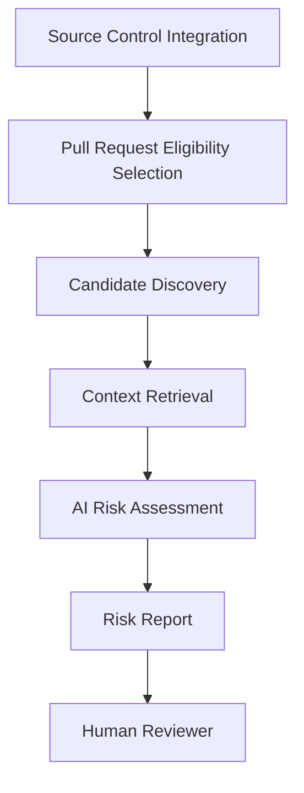

# Architecture

## Purpose

This document describes the high-level architecture of the Cross-PR Integration Risk Analyzer.

The system is organized as a sequence of independent responsibilities that transform a set of approved pull requests into an explainable integration-risk report for human reviewers.

The architecture defines the main components, their responsibilities and their boundaries. Detailed implementation strategies are described separately in the corresponding component design documents.

---

## Architectural Principles

The architecture is guided by the following principles:

- Separate factual evidence extraction from AI reasoning.
- Reduce unnecessary AI analysis before invoking more expensive reasoning.
- Use focused repository context rather than providing the complete repository to the AI.
- Preserve explainability throughout the workflow.
- Keep source-control, structural-analysis, context-retrieval and AI-provider concerns replaceable where practical.
- Keep the final engineering decision with the human reviewer.
- Avoid duplicating capabilities already provided by Git, such as textual merge-conflict detection.
- Allow individual stages to evolve without requiring the complete workflow to be redesigned.

---

## Conceptual Architecture

---

## Core Components

### Source Control Integration

Provides access to the repository and pull request information required by the analysis workflow.

Its responsibilities include retrieving and normalizing:

- pull request metadata,
- review and approval state,
- source and target branches,
- changed files,
- diffs,
- and selected repository contents.

The component also supports bounded, on-demand retrieval of selected repository file versions when Candidate Discovery or Context Retrieval requires more source context than the available diff provides. Candidate Discovery may reconstruct changed ranges from those selected before/after versions when a provider diff is unavailable or insufficient.

For pull-request change reconstruction, the selected before/after versions represent the comparison base for the changes introduced by the pull request and the pull request head. Current-target versus simulated-merge analysis is a separate concern and is not implied by this retrieval boundary.

Repository content is identified by an immutable repository revision and normalized before it is provided to the rest of the workflow. Content already retrieved during an analysis run should be reused where practical.

The rest of the analysis workflow should not depend directly on provider-specific API responses.

Provider-specific review histories, revision identifiers and content-retrieval mechanisms remain inside the source-control adapter.

---

### Pull Request Eligibility Selection

Determines which pull requests participate in the analysis.

The system focuses on pull requests that are relevant merge candidates for the same target branch.

Eligibility rules are deterministic and remain separate from later technical or AI-assisted analysis.

The Source Control Integration normalizes provider-specific review histories into a current effective review state before eligibility rules are applied.

The concrete eligibility policy may depend on normalized approval state, draft state, pull-request state and target branch. Provider-specific interpretation and release-specific policy choices are defined outside the architecture.

---

### Candidate Discovery

Examines eligible pull requests and identifies combinations that show enough objective technical relationship to justify deeper analysis.

Candidate Discovery may use:

- normalized changed-file and diff information,
- bounded language-aware structural analysis through replaceable analyzers,
- selected resulting file contents where the approved matching operation requires them.

The stage does not determine whether an actual integration risk exists.

Its responsibility is only to reduce the possible pair set and provide explainable evidence for why each selected pair deserves further investigation.

The stage selects a pair through one structural relationship: a named technical term associated with a changed region in one pull request has a matching structural occurrence in a supported file changed by the other pull request. Same-file and cross-file matches use the same evidence model; the file paths remain evidence locations rather than separate selection categories.

The selection criterion and structural-analysis strategy are defined in the Candidate Discovery design. Concrete language support belongs to the relevant release specification rather than the architecture.

---

### Context Retrieval

Prepares the focused information required to evaluate a selected Candidate Pair.

Its purpose is to provide enough context for meaningful AI reasoning without sending unnecessary repository content to the model.

The selection strategy is guided by the Technical Term Matches produced during Candidate Discovery and reuses structural information and file contents already available from that stage.

This is a distinct logical responsibility, not a requirement for an independently deployed subsystem. It may be implemented as a small context builder while remaining separate from candidate selection and semantic risk reasoning. Detailed behaviour is defined in the Context Retrieval design.

---

### AI Risk Assessment

Evaluates a Candidate Pair using:

- pull request changes,
- deterministic evidence,
- and focused repository context.

Its responsibility is to determine whether the technical relationship identified by Candidate Discovery may represent a meaningful cross-PR integration risk.

The AI should distinguish between:

- objective evidence,
- inferred assumptions,
- uncertainty,
- and missing information.

Assessment is invoked only when sufficient context is available. The concrete provider, model and orchestration strategy are release-level choices rather than architectural constraints.

Detailed assessment behaviour and future optimization paths are defined in the AI Risk Analysis design.

---

### Risk Report Generation

Transforms analysis results into a reviewer-facing report.

A report may include:

- the pull requests involved,
- evidence connecting them,
- the possible integration-risk scenario,
- severity,
- confidence,
- affected code areas,
- and recommended human checks.

The report supports reviewer prioritization.

It does not automatically approve, reject or merge pull requests.

---

## High-Level Workflow

1. Pull request and repository information is retrieved from the source-control platform.
2. Eligible approved pull requests are selected and grouped by target branch.
3. Candidate Discovery examines possible pull request combinations.
4. Pairs with meaningful technical evidence become Candidate Pairs.
5. Context Retrieval prepares relevant context from the diffs, matches and source snippets.
6. Candidate Pairs with sufficient context receive AI Risk Assessment; an unassessable pair remains visible with an explicit warning.
7. Findings are transformed into explainable reviewer-facing reports.
8. A human reviewer decides whether additional investigation or validation is required.

---

## Separation of Responsibilities

### Deterministic Processing

Responsible for:

- pull request eligibility,
- pair generation,
- objective evidence extraction,
- structural analysis where available,
- candidate selection,
- context retrieval.

### AI Reasoning

Responsible for:

- interpreting the relationship between changes,
- identifying plausible integration-risk scenarios,
- explaining the plausible incompatibility or risky combined behavior,
- estimating confidence and severity,
- recommending concrete reviewer actions.

This separation keeps factual analysis reproducible while reserving AI for semantic reasoning.

---

## Extension Points

The architecture intentionally allows several capabilities to evolve independently.

### Source Control Provider

Additional source-control platforms can be integrated without changing the analysis workflow.

### Structural Analyzer

Candidate Discovery may use different or additional language-aware structural-analysis implementations.

### Repository Context Provider

Context retrieval may evolve from lightweight deterministic retrieval to richer indexing, semantic retrieval or an external repository-context provider.

### AI Provider and Analysis Strategy

AI models, providers and orchestration strategies may evolve independently from Candidate Discovery and context retrieval.

### Caching Strategy

Different caching and reuse strategies may be introduced without changing the conceptual analysis workflow.

---

## Architectural Boundary

The system focuses on **cross-PR integration risks that are distinct from Git-detectable textual merge conflicts and may remain even when changes can coexist textually**.

Git-detectable textual merge conflicts are outside the responsibility of the analyzer. The analyzer does not itself establish or validate textual mergeability.

The system also does not attempt to provide complete static-program analysis or guarantee that a reported integration problem exists.
