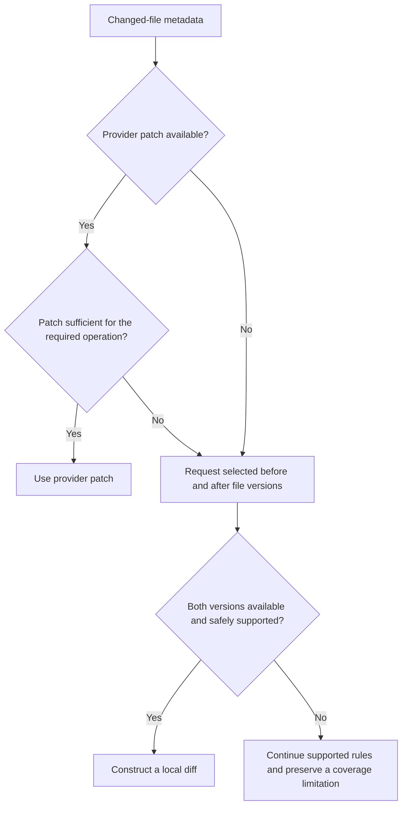

# Candidate Discovery

## Purpose

Candidate Discovery identifies pull request pairs that deserve deeper contextual and AI-assisted analysis.

It receives pull requests that have already passed Eligibility Selection and examines the technical relationship between their changes.

The stage does **not** determine whether a real integration risk exists.

Instead, it answers a narrower question:

> Is there enough objective technical relationship between these two pull requests to justify deeper analysis?

This reduces unnecessary AI calls while preserving an explainable discovery process.

---

## Inputs

Candidate Discovery receives normalized information for each eligible pull request.

Relevant inputs include:

- Pull Request ID
- Target branch
- Changed file paths
- File change type
- Diff / patch
- Selected changed file contents where structural analysis is required

Pull requests have already been filtered by the Eligibility Selection stage.

---

## Patch and Source-Content Availability

Changed-file metadata and available diff hunks are the initial change inputs to Candidate Discovery.

A provider-supplied patch is treated as a useful representation of the change, but it is not assumed to contain sufficient source context for every structural-analysis operation.

When structural analysis requires complete syntactic context, Candidate Discovery may request selected file versions through the Source Control Integration.

For a bounded supported text file, the implementation may retrieve the file versions before and after the pull-request change and construct a complete local diff when the provider-supplied patch is unavailable or insufficient.

In this flow, `before` means the immutable comparison-base revision used to identify what the pull request introduces, and `after` means the pull request's immutable head revision. It does not mean comparing the current target-branch tip directly with the feature-branch tip, and it does not simulate the repository state after a merge.



Retrieved file contents and locally constructed diffs are deterministic analysis inputs. They are not AI-generated context.

Content already retrieved during the current analysis run should be reused where practical.

If selected source content cannot be retrieved or safely processed:

- basic evidence rules continue to operate where their required inputs remain available,
- structural evidence is not produced for the unavailable content,
- the absence of structural evidence is not interpreted as proof that no relationship exists,
- and the limitation is preserved as analysis-coverage information.

Binary, unsupported or oversized files are not passed to Tree-sitter. They may still participate in file-level evidence such as `SAME_CHANGED_FILE`.

Analysis-coverage information is diagnostic metadata. It does not introduce an additional Candidate Discovery evidence rule.

---

## Pair Generation

Eligible pull requests targeting the same branch are grouped together.

For each group, every unique pair is considered once.

For **N** eligible pull requests, the total number of possible pairs is:

```text
N × (N - 1) / 2
```

For example:

```text
30 PRs → 435 possible pairs
```

Pair generation itself is inexpensive and deterministic.

Candidate Discovery exists to prevent all of these pairs from requiring AI analysis.

---

## Discovery Strategy

Candidate Discovery combines two complementary forms of evidence:

```text
Candidate Discovery

├── Basic Technical Evidence
│
└── Structural Code Evidence
```

Basic evidence works without understanding the programming language.

Structural evidence provides richer information when a supported language analyzer is available.

Both forms of evidence produce factual observations rather than risk predictions.

---

## Basic Technical Evidence

### Same Changed File

Two pull requests modify the same file.

```text
SAME_CHANGED_FILE
```

Example:

```text
PR A → src/payments/payment.service.ts
PR B → src/payments/payment.service.ts
```

This does not mean the changes conflict.

It only indicates that both pull requests affect the same technical resource.

---

### Shared Relevant Identifier

A relevant technical identifier appears in changed code from both pull requests.

```text
SHARED_IDENTIFIER
```

Possible identifiers include:

- function or method names,
- class names,
- model names,
- configuration keys,
- API-related identifiers.

Common language keywords and obvious noise should be ignored.

Lexical matching is intentionally treated as supporting evidence rather than proof that two symbols represent the same semantic entity.

---

### Changed Identifier Appears in a File Modified by the Other PR

An identifier affected by one pull request appears in the content of a file modified by another pull request.

```text
CHANGED_IDENTIFIER_IN_OTHER_CHANGED_FILE
```

Example:

```text
PR A
changes processPayment

PR B
modifies checkout.service.ts

checkout.service.ts contains:
processPayment(...)
```

This allows Candidate Discovery to connect pull requests that modify different files.

---

## Structural Code Analysis

Basic text matching cannot distinguish between different syntactic roles.

For example, the text:

```text
processPayment
```

could represent:

- a function definition,
- a method call,
- a variable,
- a comment,
- or a string.

Structural analysis provides additional information about what the code actually represents syntactically.

---

## Tree-sitter

The initial structural-analysis implementation uses **Tree-sitter**.

Tree-sitter is a local source-code parsing library.

It does not send code to an external service and does not require AI or token usage.

Its role is to transform source code into a structured syntax tree.

Conceptually:

```text
Source File
     ↓
Detect Language
     ↓
Load Language Grammar
     ↓
Tree-sitter Parser
     ↓
Syntax Tree
     ↓
Language-specific Query
     ↓
Relevant Structural Facts
```

---

## Language Grammars

Tree-sitter uses a grammar for each programming language.

A grammar describes the syntactic structure of that language and allows Tree-sitter to recognize constructs such as:

- classes,
- functions,
- methods,
- calls,
- parameters,
- identifiers.

The analyzer does not implement these parsers itself.

A language implementation provides the appropriate Tree-sitter grammar.

---

## Tree-sitter Queries

The complete syntax tree contains much more information than Candidate Discovery needs.

Small language-specific Tree-sitter queries select only the relevant syntax nodes.

For example, a query may capture:

```text
method definition
function definition
class definition
function/method call
```

The output is normalized into a common representation so the rest of Candidate Discovery does not need to understand language-specific syntax.

Conceptually:

```text
TypeScript ─┐
            │
C# ─────────┼──> Structural Analyzer
            │
Other ──────┘
                  ↓
          Common Structural Facts
```

---

## Structural Evidence

Structural information allows stronger candidate evidence than plain text matching.

### Shared Changed Symbol

Both PRs structurally affect a symbol with the same relevant name.

```text
SHARED_CHANGED_SYMBOL
```

---

### Modified Definition Referenced by the Other PR

One pull request modifies a function or method definition while another contains a matching call or reference in its changed code.

```text
MODIFIED_DEFINITION_REFERENCED_BY_OTHER_PR
```

Example:

```text
PR A
modifies definition:
processPayment

PR B
adds call:
processPayment(...)
```

This is stronger evidence than simply observing that both diffs contain the same string.

---

## What Tree-sitter Does Not Provide

Tree-sitter provides **syntactic and structural information**.

It does not provide complete semantic symbol resolution.

For example, identifying:

```text
processPayment(...)
```

as a method call does not always prove which exact method definition it refers to.

Complete resolution may require understanding:

- imports,
- aliases,
- scopes,
- overloads,
- inheritance,
- dynamic dispatch.

Candidate Discovery intentionally does not solve all of these problems.

Its goal is only to identify pairs worth deeper analysis.

The AI stage later evaluates whether the structural relationship is actually meaningful.

---

## Why Structural Analysis Is Useful

Structural analysis provides several advantages:

- more precise evidence than raw text matching,
- no AI/token cost,
- deterministic behaviour,
- reusable parsing logic,
- extensibility across programming languages,
- better input for later AI reasoning.

At the same time, keeping structural analysis limited to candidate discovery avoids turning the system into a complete static analyzer.

---

## Candidate Selection

The initial design does not require a weighted Interaction Score.

A pair becomes a Candidate Pair when at least one configured technical evidence rule provides a meaningful relationship.

The evidence responsible for selection is preserved.

This avoids introducing arbitrary numeric weights before there is evidence that such ranking is necessary.

If candidate volume later becomes too large, ranking or weighting can be introduced as an optimization.

---

## Evidence Model

Every selected pair contains structured Evidence items.

Conceptually:

```text
Candidate Pair
├── Pull Request A
├── Pull Request B
└── Evidence[]
    ├── Evidence Rule ID
    ├── Technical Resource
    ├── PR A Location
    └── PR B Location
```

Example:

```text
Evidence Rule ID:
MODIFIED_DEFINITION_REFERENCED_BY_OTHER_PR

Technical Resource:
processPayment

PR A:
src/payments/payment.service.ts

PR B:
src/checkout/checkout.service.ts
```

Evidence explains **why the pair was selected**.

It does not claim that a risk exists.

---

## Output

Candidate Discovery produces:

```text
Candidate Pair
├── Pull Request A
├── Pull Request B
└── Evidence[]
```

This output becomes the input to Repository Context Retrieval.

---

## System Boundaries

Candidate Discovery is responsible for:

- generating unique PR pairs,
- identifying objective technical relationships,
- performing structural analysis where supported,
- selecting Candidate Pairs,
- preserving the evidence that justified selection.

Candidate Discovery is not responsible for:

- confirming integration risks,
- understanding complete business behaviour,
- performing complete semantic symbol resolution,
- assigning severity or confidence,
- generating reviewer recommendations,
- detecting Git textual merge conflicts,
- executing builds or tests.

---

## Future Evolution

Candidate Discovery may later evolve through:

- additional language analyzers,
- richer symbol resolution,
- repository-wide structural indexes,
- evidence ranking,
- measured candidate thresholds,
- agentic discovery strategies.

These improvements can evolve without changing the responsibility of Candidate Discovery itself.
